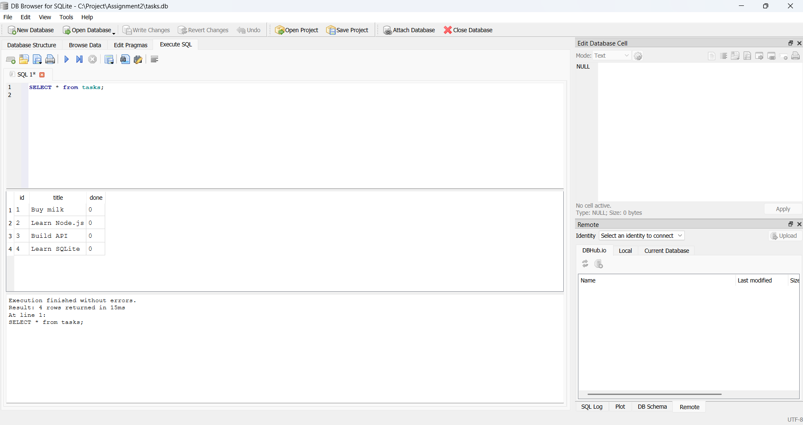
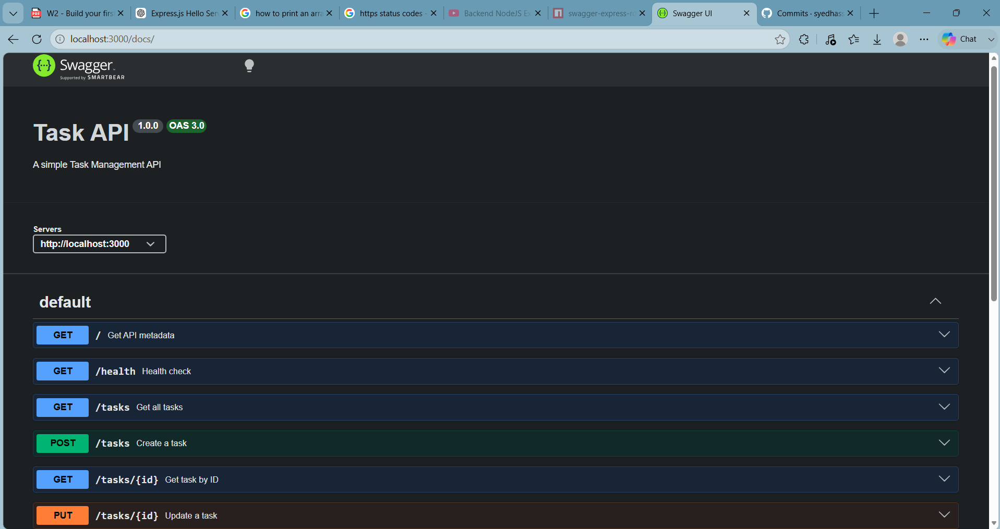

# Task API

Simple Express task management API using SQLite with OpenAPI docs.

## Prerequisites

- Node.js 18+ (or newer)
- npm

## Setup

```bash
npm install
```

## Run

Development mode (uses `nodemon` via the npm `start` script):

```bash
npm start
```

If you don't have `nodemon` installed globally you can run the app with:

```bash
npx nodemon app.js
# or
node app.js
```

App base URL:

- http://localhost:3000

API docs (Swagger UI):

- http://localhost:3000/docs

## Database

- **Why SQLite:** Lightweight, zero-configuration, file-based database ideal for small apps, demos, and assignments. It avoids the overhead of running a separate database server while providing ACID transactions and a familiar SQL surface.
- **Database file location:** `tasks.db` in the project root: [tasks.db](tasks.db#L1).

One of the SQL statements executed on startup (in `db.js`) is:

```sql
INSERT INTO tasks (title, done) VALUES ('Buy milk', 0);
```

The application code uses prepared statements for queries, for example:

```sql
SELECT * FROM tasks;
```



## Endpoint Table

| Method | Path        | Description                                   | Success Status | Error Status                   |
|--------|-------------|-----------------------------------------------|----------------|--------------------------------|
| GET    | `/`         | API metadata (`name`, `version`, `endpoints`) | `200`          | -                              |
| GET    | `/health`   | Health check                                  | `200`          | -                              |
| GET    | `/tasks`    | Get all tasks                                 | `200`          | -                              |
| GET    | `/tasks/:id`| Get a task by id                              | `200`          | `404` if not found             |
| POST   | `/tasks`    | Create a new task                             | `201`          | `400` if `title` missing/empty |
| PUT    | `/tasks/:id`| Update task `title` and/or `done`             | `200`          | `404` if not found             |
| DELETE | `/tasks/:id`| Delete a task by id                           | `200`          | `404` if not found             |

## Example API Request

```bash
curl -i -X POST http://localhost:3000/tasks -H "Content-Type: application/json" -d "{\"title\":\"Learn SQLite\"}"
```

## Swagger Documentation

Swagger UI is available at:

http://localhost:3000/docs

Screenshot:



## Notes

- Data is stored in `tasks.db` (file-based SQLite). Restarting the server preserves tasks as long as `tasks.db` is not deleted.
- `PUT /tasks/:id` returns the updated task (not the full tasks array).
